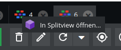

# Watza SplitViewBundle for Pimcore 11

The Watza SplitViewBundle allows you to open multiple objects simultaneously in tabs, perfect for ultrawide monitors or power users who need to work efficiently without launching multiple Pimcore instances.

## Key Features
- Open multiple objects side-by-side in a single Pimcore instance.
- Switch easily between objects without losing context.
- Ideal for ultrawide monitors or heavy admin workflows.


## Installation

1. Install via Composer:

```bash
composer require watza/splitviewbundle:dev-master
```

2. Enable the bundle in `bundles.php` by adding:

```php
Watza\SplitViewBundle\WatzaSplitViewBundle::class => ['all' => true],
```

### Requirements
- Pimcore 11 or higher

## Usage

### Method 1: Browser Console

Use the console command to open any combination of objects:

```javascript
// Replace $id1, $id2 with the object IDs you want to open
new pimcore.object.splitview($id1, $id2);
```

### Method 2: Context Menu

Right-click on an object in the tab bar → Select **"Open in SplitView"**.



## Disclaimer
- This bundle is actively developed and may change at any time.
- Recommended for experimental or personal use only.
- Bundle functionality may break after running `composer update`.
