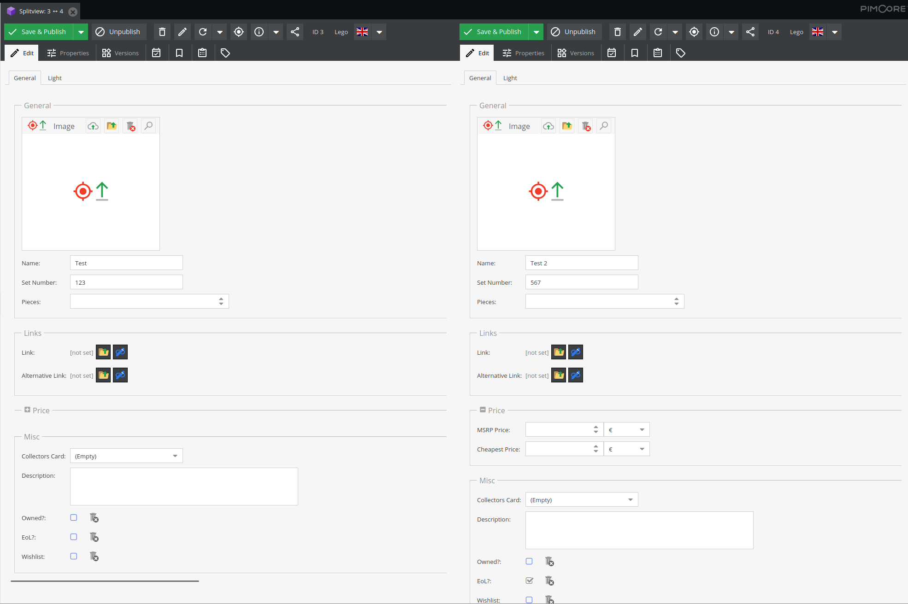

# SplitviewBundle for Pimcore

This Bundle allows opening multiple Objects in the Pimcore ExtJs Admin UI. The installation follows the Standard Symfony/Pimcore-Bundle installation.

Prerequisites: 
- Both Objects are opened as Tabs
- Pimcore > 11.5

To open the Splitview, run the following in the browser console using your desired Pimcore IDs:
> new pimcore.object.splitview(id1, id2);

## To-DO
- [x] Add Option to open Splitview in Admin UI
- [ ] Add Warning if Object is already openend in Splitview

## Known Issues
- If object gets openend again admin ui must be reloaded(?)
- Contextmenu *only* shows "Open in Splitview" instead e.g. "close all"