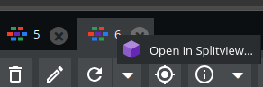

# Watza SplitViewBundle for Pimcore 11

The Watza SplitViewBundle allows you to open multiple objects simultaneously in tabs, perfect for ultrawide monitors or power users who need to work efficiently without launching multiple Pimcore instances.

## Key Features
- Open multiple objects side-by-side in a single Pimcore instance.
- Switch easily between objects without losing context.
- Ideal for ultrawide monitors or heavy admin workflows.

## Installation

1. Install via Composer:

composer require watza/splitviewbundle:dev-master

2. Enable the bundle in bundles.php by adding:

Watza\SplitViewBundle\WatzaSplitViewBundle::class => ['all' => true],

### Requirements
- Pimcore 11.4 or higher

## Quick Start

Open multiple objects in your Pimcore Admin UI in just two steps:

// Example: Open objects with IDs 1 and 2
new pimcore.object.splitview(1, 2);

Or right-click on any object in the tab bar and select "Add to SplitView".

## Usage

### Method 1: Browser Console
Use the console command to open any combination of objects:

new pimcore.object.splitview($id1, $id2);

Replace $id1, $id2 with the object IDs you want to open.

### Method 2: Context Menu
Right-click on an object in the tab bar -> Select "Add to SplitView".

## Disclaimer
- This bundle is actively developed and may change at any time.
- Recommended for experimental or personal use only.
- Bundle Functionality may break after running composer update.